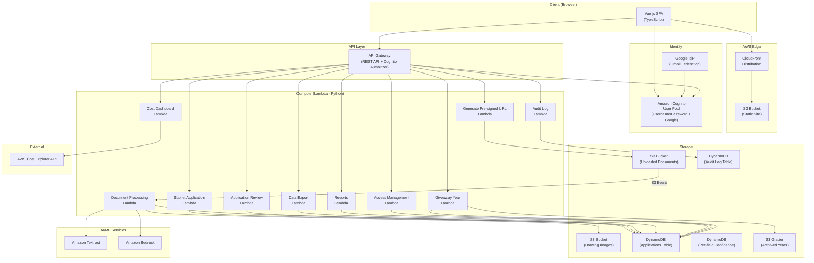
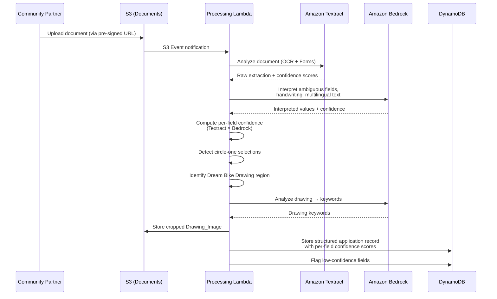
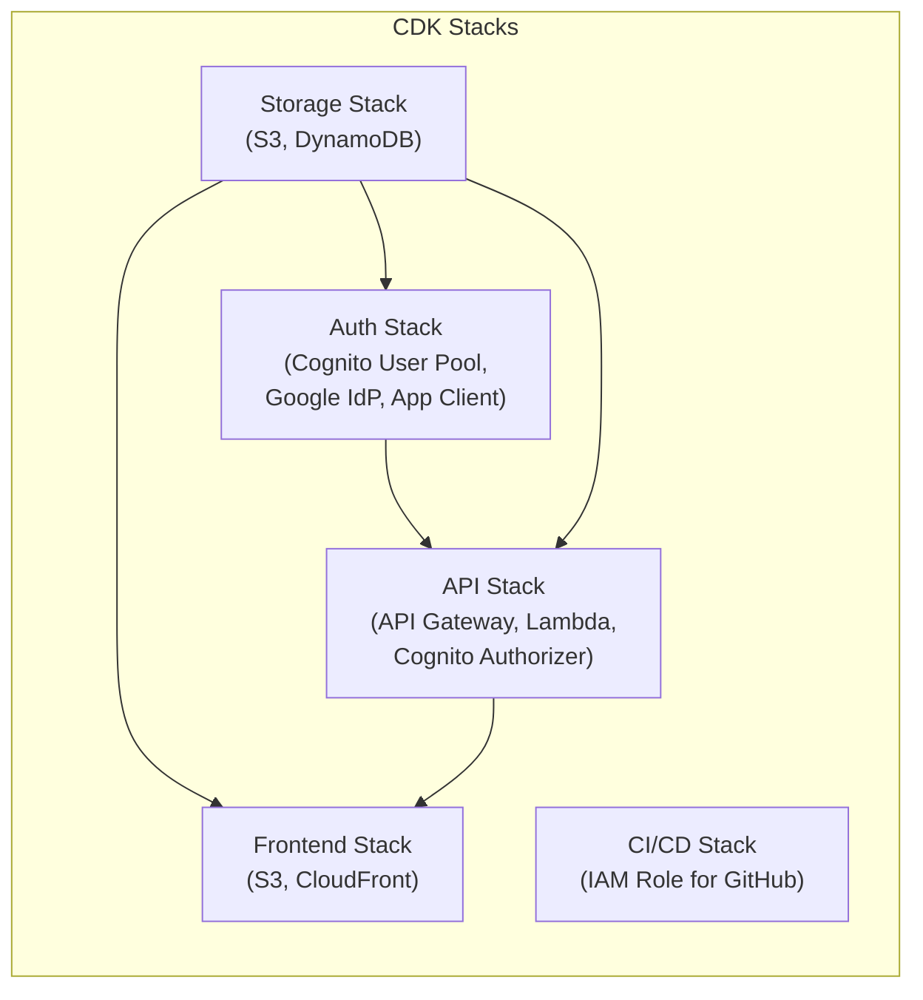

# Design Document: BBP Holiday Kids Bike Giveaway System

## Overview

This system is a serverless web application for the Boise Bicycle Project's annual Holiday Kids Bike Giveaway. It replaces a manual, paper-heavy process with a digital pipeline that accepts applications (digital forms or scanned/photographed paper forms), automatically extracts structured data using OCR and AI, and provides an admin dashboard for review, correction, reporting, and export.

The architecture is fully serverless on AWS to minimize cost for a nonprofit. The frontend is a Vue.js (TypeScript) SPA hosted on S3/CloudFront. The backend is Python Lambda functions behind API Gateway. DynamoDB stores all application data. Amazon Textract handles OCR, and Amazon Bedrock interprets messy handwriting, multilingual content, and dream bike drawings.

Security is the top priority — the system stores PII of minors. All data is encrypted at rest and in transit, access is role-based with least-privilege IAM, and every action is audit-logged.

### Key Design Decisions

0. **Codenames for open-source repository**: Since this project is committed to a public open-source repository, all frontend UI text, page titles, labels, and user-facing copy use codenames to avoid association with the real organization during development. **"Greenfield Foundation"** (or "Greenfield") replaces any reference to the organization, and **"Community Gift Program"** (or "Gift Program") replaces any reference to the annual event. Backend resource names (DynamoDB tables like `bbp-hkbg-*`, S3 buckets, Lambda function names, CDK stack names) remain unchanged — only user-visible frontend strings use codenames.
1. **Serverless-only architecture**: No always-on compute. Lambda, DynamoDB, S3, and CloudFront are all pay-per-use, keeping costs near zero outside the Oct–Dec season.
2. **Cognito for identity, no application-stored passwords**: Amazon Cognito User Pool handles all authentication. Users can sign in with Cognito-native username/password or via Google (Gmail) federation. Cognito manages all credential storage, password policies, and reset flows — the application database never stores passwords or hashes. User roles (admin/reporter/submitter) are stored in DynamoDB and enforced by Lambda authorizer logic after Cognito validates the token.
3. **Textract + Bedrock two-stage pipeline**: Textract provides raw OCR with confidence scores; Bedrock interprets ambiguous results, handles multilingual content, and analyzes drawings. This separation keeps each stage focused and testable.
4. **Per-field confidence scoring**: Every extracted value carries its own confidence score, enabling precise flagging and targeted human review rather than whole-application rejection.
5. **Giveaway year as a partition key dimension**: All data is tagged by year, enabling clean lifecycle management (archive to Glacier, permanent deletion) without affecting other years.
6. **Separate audit log table**: Audit entries go to a dedicated DynamoDB table to avoid coupling audit retention with application data lifecycle.
7. **Pre-signed URLs for uploads**: Files go directly from the browser to S3 via pre-signed URLs, keeping Lambda out of the data path for large files.
8. **Vue i18n for multilingual UI**: Browser language detection + manual toggle, with all strings externalized for English and Spanish.
9. **Auth bypass for local development**: When the environment variable `AUTH_ENABLED` is set to `false`, the backend skips Cognito token validation and injects a hardcoded local admin user identity into the request context. The frontend similarly bypasses the Cognito login flow and treats the session as an authenticated admin. This is enforced only in local/dev environments — the deployed CDK stacks always set `AUTH_ENABLED=true` and the CI/CD pipeline never allows `false` to reach a deployed environment.

## Architecture

### High-Level Architecture Diagram



### Processing Pipeline Flow



## Components and Interfaces

### Frontend Components (Vue.js / TypeScript)

#### 1. Digital Application Form (`/apply`)
- Multi-section form: Referring Agency Info → Parent/Guardian Info → Child Info (repeatable) → Dream Bike Drawing per child
- All user-facing text uses codenames: "Greenfield Foundation" for the organization, "Community Gift Program" for the event
- Vue i18n for English/Spanish with browser detection and manual toggle
- Client-side validation: all required fields, height as numeric inches, file type/size for drawing uploads
- Responsive layout targeting 320px minimum width
- Submits directly to REST API; digital submissions get confidence 1.0

#### 2. Upload Portal (`/upload`)
- Drag-and-drop + file picker for PDF, PNG, JPEG (max 10MB per file)
- Multi-file upload support for multi-page applications
- Requests pre-signed URL from API, uploads directly to S3
- Displays confirmation with reference ID on success
- Bilingual instructions (English/Spanish)

#### 3. Admin Dashboard (`/admin`)
- **Application List View**: Sortable/filterable table with family name, date, source, status, confidence score, drawing thumbnail
- **Side-by-Side Review View**: Original document viewer (multi-page navigation) on left, editable transcription form on right. Per-field confidence badges. Low-confidence fields highlighted.
- **Reports Section**: Custom report builder with column picker, multi-filter, grouping, sorting, charts (bar/pie), saved reports, pre-built templates, CSV export, pagination
- **Cost Dashboard**: Service-level cost breakdown, 6-month trend chart, cost-per-application, budget threshold with alert
- **Access Management**: User CRUD, role assignment (admin/reporter/submitter), giveaway year scoping for reporters, enable/disable accounts. Users authenticate via Cognito (username/password or Google/Gmail federation) — no passwords stored in the application.
- **Audit Log Viewer**: Reverse-chronological log with filters (user, action, resource, date range), CSV export
- **Giveaway Year Management**: Set active year, archive year (→ Glacier), delete year (with confirmation), switch between years

#### 4. Shared Components
- `LanguageToggle`: Switches locale, persists preference
- `ConfidenceBadge`: Color-coded confidence indicator (green ≥ threshold, yellow near threshold, red below)
- `DrawingViewer`: Displays Drawing_Image with keyword tags
- `SessionTimeout`: Auto-logout after 30 minutes of inactivity
- `AuthGuard`: Route guard that checks Cognito session; redirects to login if unauthenticated; checks DynamoDB role for route-level authorization. When `AUTH_ENABLED=false`, bypasses all checks and presents a default local admin user.

### Backend Lambda Functions (Python)

| Function | Trigger | Purpose | AWS Permissions |
|---|---|---|---|
| `submit_application` | API Gateway POST | Stores digital form data in DynamoDB with confidence 1.0 | DynamoDB write |
| `generate_presigned_url` | API Gateway POST | Returns pre-signed S3 upload URL (15-min expiry) | S3 PutObject |
| `process_document` | S3 Event | Orchestrates Textract → Bedrock → DynamoDB pipeline | Textract, Bedrock, S3 read/write, DynamoDB write |
| `get_applications` | API Gateway GET | Lists/searches/filters applications (year-scoped) | DynamoDB read |
| `get_application_detail` | API Gateway GET | Returns single application with all fields + confidence | DynamoDB read, S3 read (pre-signed for images) |
| `update_application` | API Gateway PUT | Saves edits, sets edited field confidence to 1.0, updates status | DynamoDB read/write |
| `export_data` | API Gateway POST | Generates CSV (bike build list or family contact list) | DynamoDB read |
| `manage_reports` | API Gateway CRUD | Save/load/delete report configurations | DynamoDB read/write |
| `run_report` | API Gateway POST | Executes report query with filters/grouping/aggregation | DynamoDB read |
| `get_cost_data` | API Gateway GET | Fetches cost data from Cost Explorer (cached daily) | Cost Explorer read |
| `manage_users` | API Gateway CRUD | User account CRUD, role assignment, Cognito user management | DynamoDB read/write, Cognito admin |
| `get_audit_log` | API Gateway GET | Queries audit log with filters | DynamoDB (audit table) read |
| `manage_giveaway_year` | API Gateway POST | Set active year, archive, delete | DynamoDB read/write, S3 lifecycle/delete, S3 Glacier |
| `audit_middleware` | Invoked by other Lambdas | Writes audit log entries | DynamoDB (audit table) write |

### REST API Endpoints

| Method | Path | Auth | Description |
|---|---|---|---|
| POST | `/api/applications` | Public (rate-limited) | Submit digital form |
| POST | `/api/uploads/presign` | Public (rate-limited) | Get pre-signed upload URL |
| GET | `/api/applications` | Admin, Reporter (year-scoped) | List/search applications |
| GET | `/api/applications/{id}` | Admin | Get application detail |
| PUT | `/api/applications/{id}` | Admin | Update application fields |
| PUT | `/api/applications/{id}/status` | Admin | Approve/reject application |
| PUT | `/api/applications/{id}/children/{childId}/bike-number` | Admin | Assign bike number |
| PUT | `/api/applications/{id}/children/{childId}/drawing-keywords` | Admin | Edit drawing keywords |
| POST | `/api/exports/bike-build-list` | Admin, Reporter (year-scoped) | Export bike build CSV |
| POST | `/api/exports/family-contact-list` | Admin, Reporter (year-scoped) | Export family contact CSV |
| GET | `/api/reports/saved` | Admin, Reporter | List saved reports |
| POST | `/api/reports/saved` | Admin, Reporter | Save report config |
| DELETE | `/api/reports/saved/{id}` | Admin, Reporter | Delete saved report |
| POST | `/api/reports/run` | Admin, Reporter (year-scoped) | Execute report query |
| POST | `/api/reports/export` | Admin, Reporter (year-scoped) | Export report as CSV |
| GET | `/api/cost-dashboard` | Admin | Get cost data |
| PUT | `/api/cost-dashboard/budget` | Admin | Set budget threshold |
| GET | `/api/users` | Admin | List users |
| POST | `/api/users` | Admin | Create user |
| PUT | `/api/users/{id}` | Admin | Update user |
| DELETE | `/api/users/{id}` | Admin | Delete user |
| POST | `/api/users/{id}/disable` | Admin | Disable user in Cognito + DynamoDB |
| POST | `/api/users/{id}/enable` | Admin | Re-enable user in Cognito + DynamoDB |
| GET | `/api/audit-log` | Admin | Query audit log |
| POST | `/api/audit-log/export` | Admin | Export audit log CSV |
| GET | `/api/giveaway-years` | Admin | List giveaway years |
| POST | `/api/giveaway-years/active` | Admin | Set active year |
| POST | `/api/giveaway-years/{year}/archive` | Admin | Archive year |
| POST | `/api/giveaway-years/{year}/delete` | Admin | Delete year data |
| GET | `/api/auth/me` | Authenticated | Return current user profile + role (from Cognito token + DynamoDB) |

## Data Models

### DynamoDB Table: Applications

**Table Name:** `bbp-hkbg-applications`
**Partition Key:** `giveaway_year` (String)
**Sort Key:** `application_id` (String, ULID)

**GSI-1:** `status-index` — PK: `giveaway_year`, SK: `status` (for filtering by status within a year)
**GSI-2:** `agency-index` — PK: `giveaway_year`, SK: `referring_agency_name` (for agency-based queries)

```json
{
  "giveaway_year": "2025",
  "application_id": "01JXXXXXXXXXXXXXXX",
  "submission_timestamp": "2025-11-15T10:30:00Z",
  "source_type": "upload | digital",
  "status": "needs_review | auto_approved | manually_approved | extraction_failed",
  "overall_confidence_score": 0.72,
  "confidence_threshold": 0.80,
  "referring_agency": {
    "agency_name": "Partner Org",
    "contact_name": "Jane Doe",
    "contact_phone": "208-555-0100",
    "contact_email": "jane@partner.org"
  },
  "parent_guardian": {
    "first_name": "Maria",
    "last_name": "Garcia",
    "address": "123 Main St",
    "city": "Boise",
    "zip_code": "83702",
    "phone": "208-555-0101",
    "email": "maria@example.com",
    "primary_language": "Spanish",
    "english_speaker_in_household": false,
    "preferred_contact_method": "WhatsApp | Phone Call | Text Message | Email",
    "transportation_access": true
  },
  "children": [
    {
      "child_id": "child-001",
      "first_name": "Carlos",
      "last_name": "Garcia",
      "height_inches": 48,
      "age": 8,
      "gender": "Male | Female | Non-binary",
      "bike_color_1": "Blue",
      "bike_color_2": "Black",
      "knows_how_to_ride": true,
      "other_siblings_enrolled": "Sofia Garcia",
      "drawing_image_s3_key": "drawings/2025/01JXXX/child-001.png",
      "drawing_keywords": ["blue", "mountain bike", "streamers", "bell"],
      "dream_bike_description": "A blue mountain bike with streamers",
      "bike_number": "B-2025-042"
    }
  ],
  "field_confidence": {
    "referring_agency.agency_name": 0.95,
    "referring_agency.contact_name": 0.88,
    "referring_agency.contact_phone": 0.72,
    "referring_agency.contact_email": 0.91,
    "parent_guardian.first_name": 0.93,
    "parent_guardian.last_name": 0.85,
    "parent_guardian.preferred_contact_method": 0.65,
    "children[0].first_name": 0.90,
    "children[0].height_inches": 0.78,
    "children[0].gender": 0.82
  },
  "original_documents": [
    {
      "s3_key": "uploads/2025/01JXXX/page1.pdf",
      "upload_timestamp": "2025-11-15T10:29:00Z",
      "page_count": 3
    }
  ],
  "version": 3,
  "previous_versions_s3_key": "versions/2025/01JXXX/v2.json"
}
```

### DynamoDB Table: Audit Log

**Table Name:** `bbp-hkbg-audit-log`
**Partition Key:** `year_month` (String, e.g., "2025-11")
**Sort Key:** `timestamp#user_id` (String, composite for uniqueness and chronological ordering)

**GSI-1:** `user-index` — PK: `user_id`, SK: `timestamp` (for per-user queries)
**GSI-2:** `action-index` — PK: `action_type`, SK: `timestamp` (for action-type queries)

```json
{
  "year_month": "2025-11",
  "timestamp#user_id": "2025-11-15T10:35:00Z#user-admin-001",
  "user_id": "user-admin-001",
  "user_name": "Admin User",
  "timestamp": "2025-11-15T10:35:00Z",
  "action_type": "view | create | update | delete | export | login | logout",
  "resource_type": "application | child_record | report | user_account | giveaway_year",
  "resource_id": "01JXXXXXXXXXXXXXXX",
  "details": {
    "field_name": "parent_guardian.phone",
    "previous_value": "208-555-0100",
    "new_value": "208-555-0199"
  },
  "ttl": 1763222100
}
```

### DynamoDB Table: Users

**Table Name:** `bbp-hkbg-users`
**Partition Key:** `user_id` (String)

**GSI-1:** `email-index` — PK: `email` (for login lookup)

```json
{
  "user_id": "user-001",
  "cognito_sub": "google_117XXXXXXXXXXXXXXXXX",
  "email": "admin@bbp.org",
  "name": "Admin User",
  "role": "admin | reporter | submitter",
  "authorized_giveaway_years": ["2024", "2025"],
  "status": "active | inactive",
  "last_login": "2025-11-15T10:00:00Z",
  "created_at": "2025-10-01T00:00:00Z",
  "updated_at": "2025-11-15T10:00:00Z"
}
```

### DynamoDB Table: Saved Reports

**Table Name:** `bbp-hkbg-saved-reports`
**Partition Key:** `user_id` (String)
**Sort Key:** `report_id` (String)

```json
{
  "user_id": "user-001",
  "report_id": "rpt-001",
  "name": "Height Distribution 2025",
  "columns": ["child_first_name", "child_last_name", "height_inches", "age"],
  "filters": [
    { "field": "giveaway_year", "operator": "equals", "value": "2025" },
    { "field": "status", "operator": "in", "value": ["manually_approved", "auto_approved"] }
  ],
  "group_by": "height_inches",
  "sort_by": "height_inches",
  "sort_order": "asc",
  "created_at": "2025-11-10T00:00:00Z",
  "updated_at": "2025-11-15T00:00:00Z"
}
```

### DynamoDB Table: System Configuration

**Table Name:** `bbp-hkbg-config`
**Partition Key:** `config_key` (String)

```json
{
  "config_key": "active_giveaway_year",
  "value": "2025"
}
```
```json
{
  "config_key": "confidence_threshold",
  "value": "0.80"
}
```
```json
{
  "config_key": "monthly_cost_budget",
  "value": "50.00"
}
```
```json
{
  "config_key": "cost_data_cache",
  "value": { "last_fetched": "2025-11-15T00:00:00Z", "data": {} }
}
```

### S3 Bucket Structure

```
bbp-hkbg-documents/
├── uploads/{giveaway_year}/{application_id}/     # Original uploaded files
├── drawings/{giveaway_year}/{application_id}/    # Cropped drawing images
├── versions/{giveaway_year}/{application_id}/    # Previous record versions
└── exports/                                       # Temporary export files

bbp-hkbg-static/
├── index.html
├── assets/
└── locales/
    ├── en.json    # All user-facing strings use codenames (Greenfield Foundation, Community Gift Program)
    └── es.json    # Spanish translations also use codenames
```

### Infrastructure (CDK - TypeScript)

The CDK stack defines:

1. **S3 Buckets**: Documents bucket (with lifecycle rules for Glacier transition), static site bucket (with Block Public Access on documents bucket)
2. **CloudFront Distribution**: Origins for static site bucket, HTTPS-only, custom error pages for SPA routing
3. **DynamoDB Tables**: Applications, Audit Log, Users, Saved Reports, Config — all with encryption at rest enabled
4. **Cognito User Pool**: User pool with native username/password sign-in and Google as federated identity provider, app client for the SPA, hosted UI or custom UI redirect flow, OAuth 2.0 / OIDC tokens, Cognito-managed password policies and reset flows
5. **API Gateway**: REST API with Cognito User Pool authorizer on authenticated endpoints, rate limiting on public endpoints, CORS configuration
6. **Lambda Functions**: Python runtime, least-privilege IAM roles per function, environment variables for table names and bucket names
6. **S3 Event Notification**: Triggers `process_document` Lambda on object creation in uploads prefix
7. **IAM Roles**: Per-Lambda roles with scoped permissions (no wildcards), CI/CD role with deployment-only permissions


